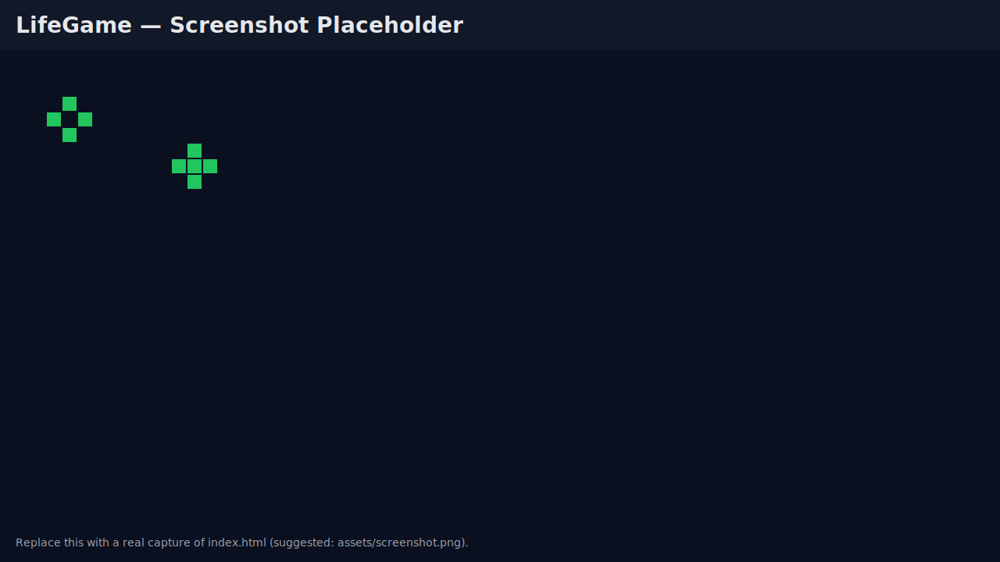
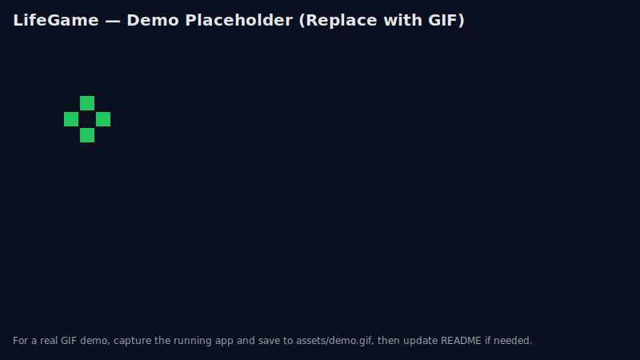

# LifeGame (Browser)

## What I Built
- Static browser app with `index.html`, `src/styles.css`, and `src/app.js`.
- Interactive controls: Play/Pause, Step, Clear, Random, Speed (FPS), Cell size, Wrap (toroidal), and grid resize (rows/cols).
- Mouse support for painting cells (click/drag), plus keyboard shortcuts: Space (toggle), R (random), C (clear), S (step).

## How To Run
- Open `index.html` directly in your browser, or
- Start a local server: `make serve`, then open `http://localhost:5173`.

## Files
- `index.html`: Main page and control panel.
- `src/styles.css`: Minimal dark theme and layout.
- `src/app.js`: Game of Life engine, canvas rendering, and UI wiring.
- `Makefile`: Convenience `serve` target using Python’s `http.server`.

## Notes
- Default grid is 80×50, with toroidal wrapping ON.
- Adjust cell size and FPS live; resizing resets the grid for simplicity.
- Rendering uses Canvas with light grid lines and green live cells.

## Screenshots

Replace these placeholders with real captures when ready:
- Screenshot: export to `assets/screenshot.png` (keep the same name or update the link).
- Demo GIF: record and save as `assets/demo.gif` (you can use tools like ScreenFlow, Kap, or ffmpeg+gifski).
